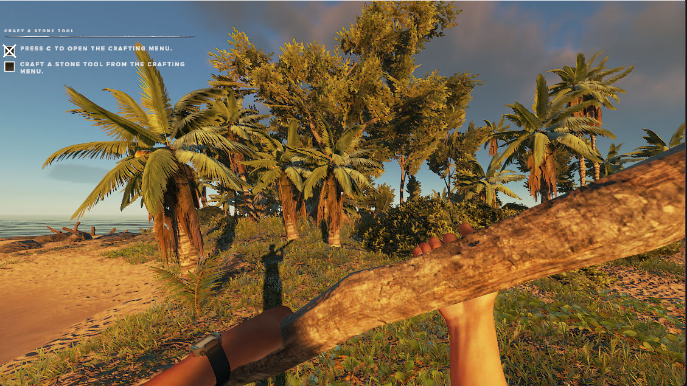
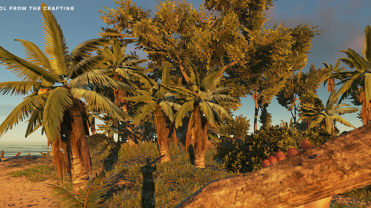

# B2: C++ AI-Powered Game Upscaler

**B2** is a lightweight, AI-enhanced upscaler for Windows games. It utilizes the Windows Magnification API combined with custom shaders to intelligently upscale game resolution with improved visual quality.

---

## 🔧 How It Works

- Leverages the **Windows Magnification API** to scale low-resolution frames.
- Applies **custom AI-based shaders** to enhance image clarity and reduce artifacts.
- Works at the system level — **compatible with any game**.

---

## ✅ Features

- 💡 **Universal Compatibility**: Works with *any* game on Windows 8 or later.
- 🚀 **Ultra Lightweight**: Uses ~10MB RAM, with **0% CPU and GPU usage**.
- ⚡ **Optimized Performance**: Designed for smooth real-time upscaling without lag or stutter.

---

## 📊 Tested Resolutions

| Input Resolution | Output Resolution | Quality                |
|------------------|-------------------|------------------------|
| 720p             | 1080p             | ⭐⭐⭐⭐☆ (Recommended)   |
| 634p             | 1080p             | ⭐⭐⭐☆☆                 |
| 480p             | 1080p             | ⭐⭐☆☆☆ (Not Recommended) |

> 🔹 **Note:** For best results, use the **720p → 1080p** preset. Lower input resolutions are supported but may reduce visual fidelity.

---

## 📷 Demo

**Upscaled Output (634p → 1080p)**  
*Real-time upscale applied using B2*

### 🖥️ Fullscreen View

### 🔍 Zoomed-In Detail View

---

